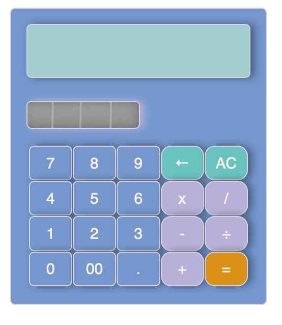

# Calculator Project

### Photo of Calculator:

### Our Calculator:

## MVP (Summarised):

### Javascript

-   The calculator must display a calculation.
-   it should also handle decimals
-   should handle at least 2 numbers
-   DO NOT USE EVAL() OR FUNCTION()

### HTML & CSS

-   An image of a calculator from the internet will be reproduced using HTML & CSS
-   Number keys 1-9 (including 0), operator keys (+, -, x, /) and period key (.) should be usable
-   Order of operations does not need to be supported

### Hurdles Encountered

-   My initial issue arised when attempting to select the button aspects to link the html to the js file. After reseraching and lots of trial and error, the missing word was 'array' which was preventing the selection of the buttons. 

-   The easiest and most compiled solution involved the eval function, it was challenging not to use it and to find other ways. 

### Coding decisions

- Main goal of mine was to understand how the functions are working and how to create a functioning calculator. Using iterators and switch statements simplified the code where it was both readable and executed efficiently.    

### Calculator Functionalities

-   supports use of basic operators such as +, -, x and /.
-   can handle up to 2 numbers
-   has an option to clear all numbers OR backspace just the last key entered.
